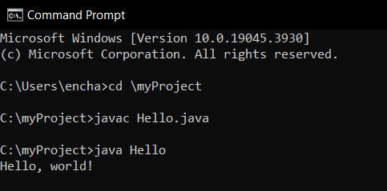
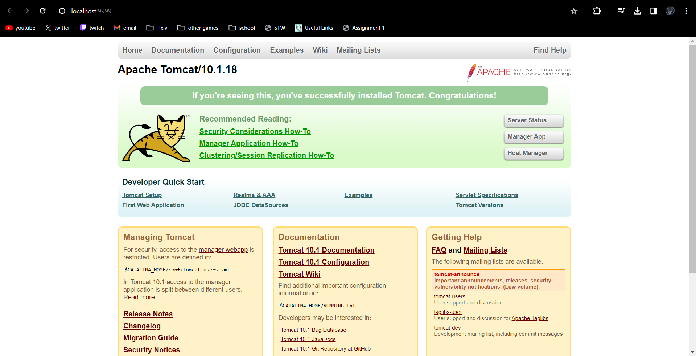

> **NOTE:** This README.md file should be placed at the **root of each of your repos directories.**
>
>Also, this file **must** use Markdown syntax, and provide project documentation as per below--otherwise, points **will** be deducted.
>

# LIS4368 - Advanced Web Applications

## Tanner Morlan

### Assignment 1 Requirements:

*Three Parts:*

1. Distributed Version Control with Git and Bitbucket
2. Java/JSP/Servlet Development Installation
3. Chapter Questions (Ch 1 - 4)

#### README.md file should include the following items:

* Screenshot of running java Hello (#1 above);
* Screenshot of running http://localhost:9999 (#2 above, Step #4(b) in tutorial);
* Screenshot of a1/index.jsp
* Bitbucket repo links: a. This assignment, and b. The completed tutorial repo above (bitbucketstationlocations).

> This is a blockquote.
> 
> This is the second paragraph in the blockquote.
>
> #### Git commands w/short descriptions:

1. git init: Create an empty Git repository or reinitialize an existing one
2. git status: Show the working tree status
3. git add: Add file contents to the index
4. git commit: Record changes to the repository
5. git push: Update remote refs along with associated objects
6. git pull: Fetch from and integrate with another repository or a local branch
7. One addition git command - git clone: Clone a repository into a new directory

#### Assignment Screenshots:

*Screenshot of running java Hello*:

*Screenshot of running http://localhost:9999*:

#### Tutorial Links:

*Bitbucket Tutorial - Station Locations:*
[A1 Bitbucket Station Locations Tutorial Link](https://bitbucket.org/tannerworkspace/bitbucketstationlocations/src/main/ "Bitbucket Station Locations")
