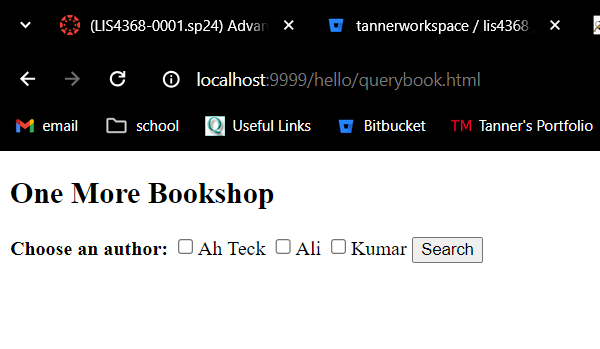
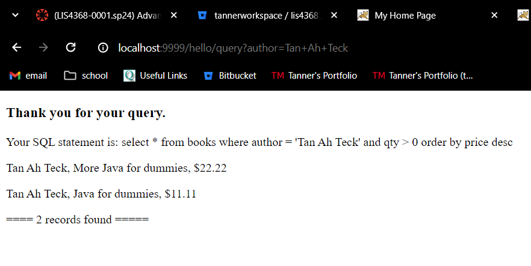
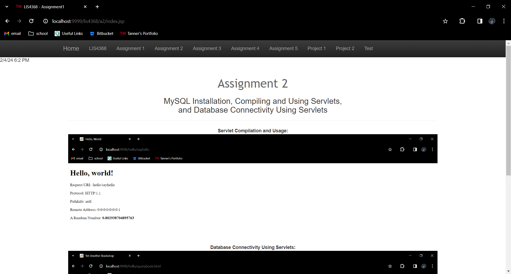
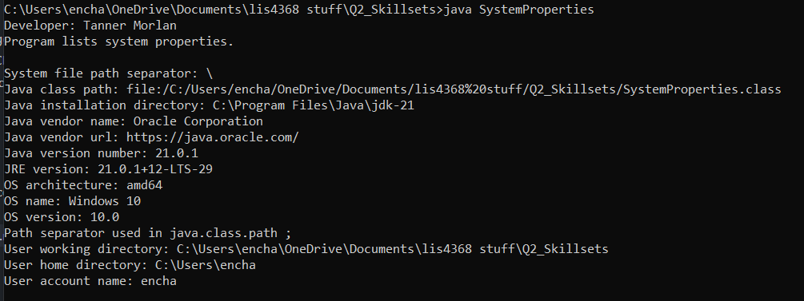
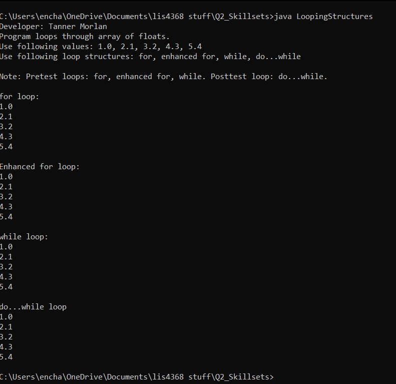
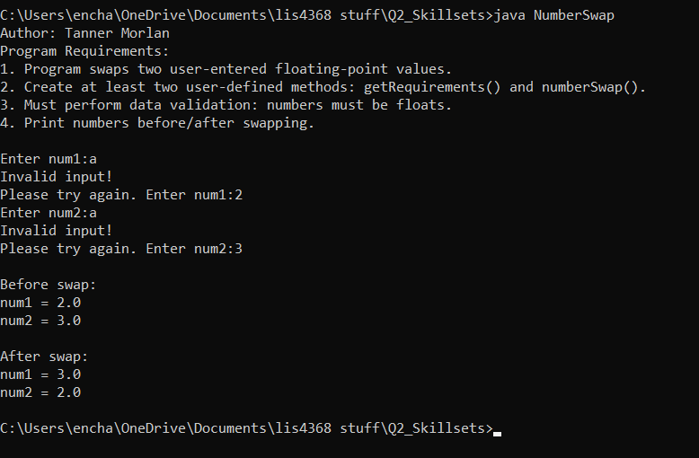

> **NOTE:** This README.md file should be placed at the **root of each of your repos directories.**
>
>Also, this file **must** use Markdown syntax, and provide project documentation as per below--otherwise, points **will** be deducted.
>

# LIS 4368 - Advanced Web Applications

## Tanner Morlan

### Assignment 2 Requirements:

*Two Parts:*

1. Servlet Compilation and Usage
2. Database Connectivity Using Servlets

#### README.md file should include the following items:

* Assessment links
* Screenshots (3 minimum): 1) querybook.html, 2) the query results, and 3) a screenshot of your a2/index.jsp file

#### Assessment Links:
- http://localhost:9999/hello
- http://localhost:9999/hello/HelloHome.html \s\s
  (HelloHome.html is later changed to index.html, so this link is currently invalid and only included for the sake of being thorough)
- http://localhost:9999/hello/sayhello
- http://localhost:9999/hello/querybook/html

#### Assignment Screenshots:

*Screenshot of Querybook Page http://localhost:9999/hello/querybook.html*:

*Screenshot of Query Results*:

*Screenshot of a2/index.jsp*:

#### Skillset Screenshots

*Screenshot of Skillset 1*

*Screenshot of Skillset 2*

*Screenshot of Skillset 3*

