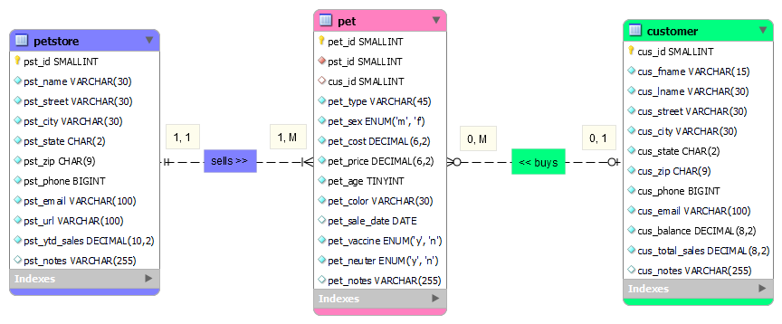
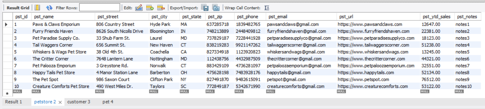
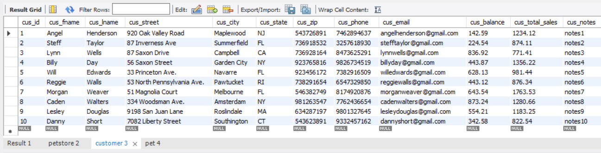
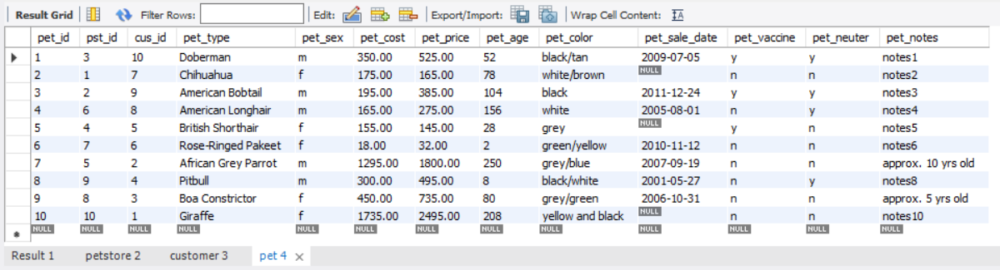
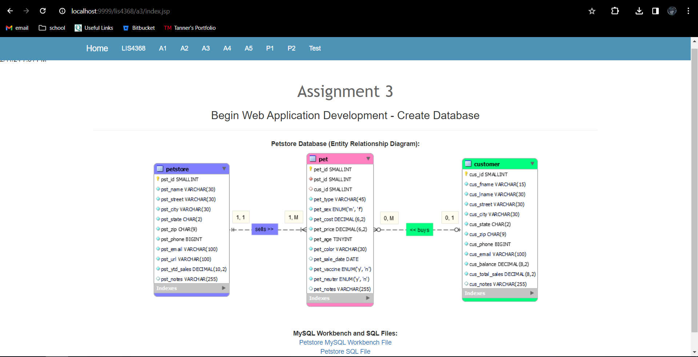
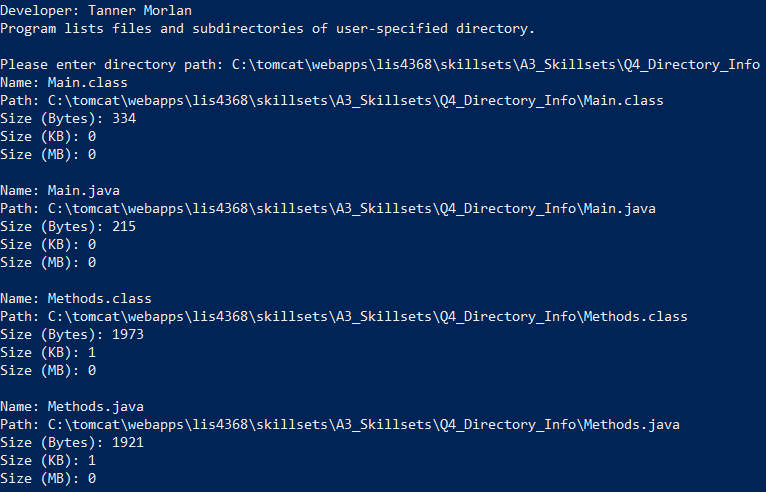
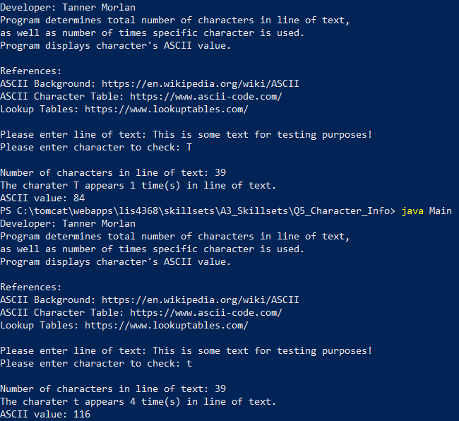
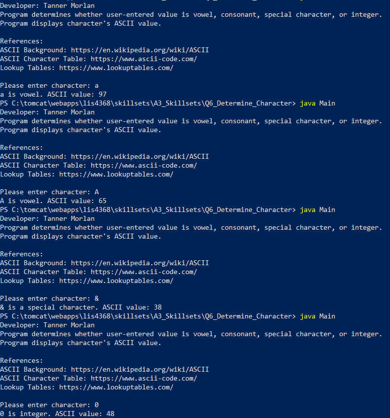

> **NOTE:** This README.md file should be placed at the **root of each of your repos directories.**
>
>Also, this file **must** use Markdown syntax, and provide project documentation as per below--otherwise, points **will** be deducted.
>

# LIS 4368 - Advanced Web Applications

## Tanner Morlan

### Assignment 3 Requirements:

*Deliverables:*

1. Entity Relationship Diagram (ERD)
1. Include data (at least 10 records in each table)
1. Provide Bitbucket read-only access to repo (Language SQL). *must* include README.md using Markdown syntax and include link to all of the following files (from README.md):
    - docs folder: a3.mwb and a3.sql
    - img folder: a3.png (export a3.mwb file as a3.png)
    - README.md (*MUST* display a3.png ERD)

#### README.md file should include the following items:

* Screenshot of ERD
* Screenshots of 10 records for each table
* Screnshot of a3/index.jsp
* Links to a3.mwb and a3.sql

#### Assignment Screenshot and Links:
*Screenshot of A3 ERD*:

*Screenshot of 10 Records for Each Table*

*Screenshot of a3/index.jsp*

*A3 docs: a3.mwb and a3.sql*: \
[A3 MWB File](docs/a3.mwb "A3 ERD in .mwb format")
[A3 SQL File](docs/a3.sql "A3 SQL Script")

#### Skillset Screenshots

*Screenshot of Skillset 4*

*Screenshot of Skillset 5*

*Screenshot of Skillset 6*

