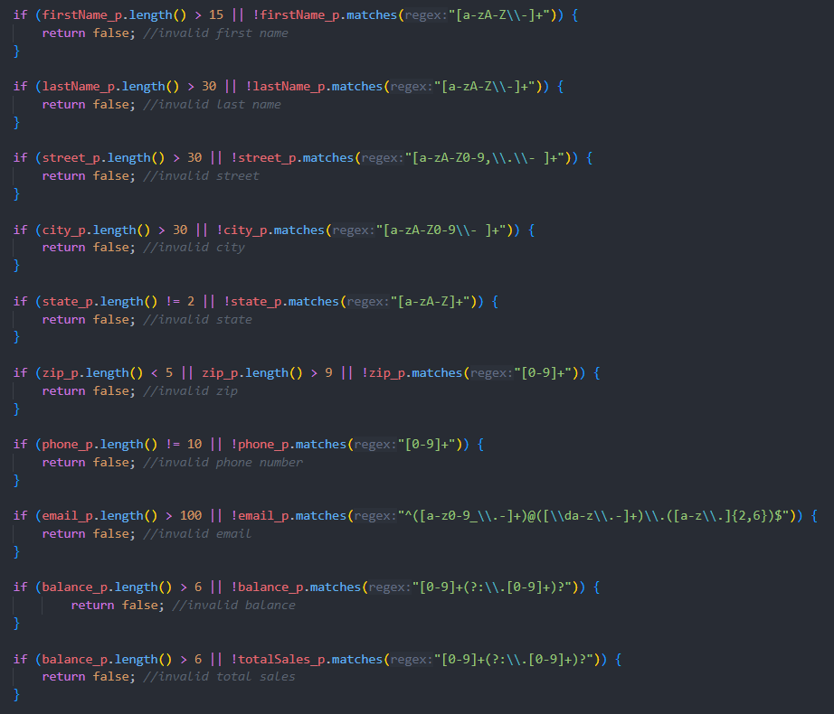

> **NOTE:** This README.md file should be placed at the **root of each of your repos directories.**
>
>Also, this file **must** use Markdown syntax, and provide project documentation as per below--otherwise, points **will** be deducted.
>

# LIS 4368 - Advanced Web Applications

## Tanner Morlan

### Assignment 4 Requirements:

*Deliverables:*

1. Learn about MVC and put it into practice
1. Use regexp to only allow appropriate characters for each control
1. Add server-side validation
1. Compile servlet files
1. Failed Validation
1. Passed Validation
1. Make server-side validation EXACTLY the same as client side
1. Complete Skillsets 10-12

#### README.md file should include the following items:

* Screenshot of failed validation
* Screenshot of passed validation
* Screenshots of skillsets
* Screenshot of server-side validation

#### Assignment Screenshot and Links:
*Screenshot of Failed Validation*:  

*Screenshot of Passed Validation*:  

#### Server-side Validation

*Screenshot of Server-side Validation Code*

#### Skillset Screenshots

*Screenshot of Skillset 10*

*Screenshot of Skillset 11*

*Screenshot of Skillset 12*

