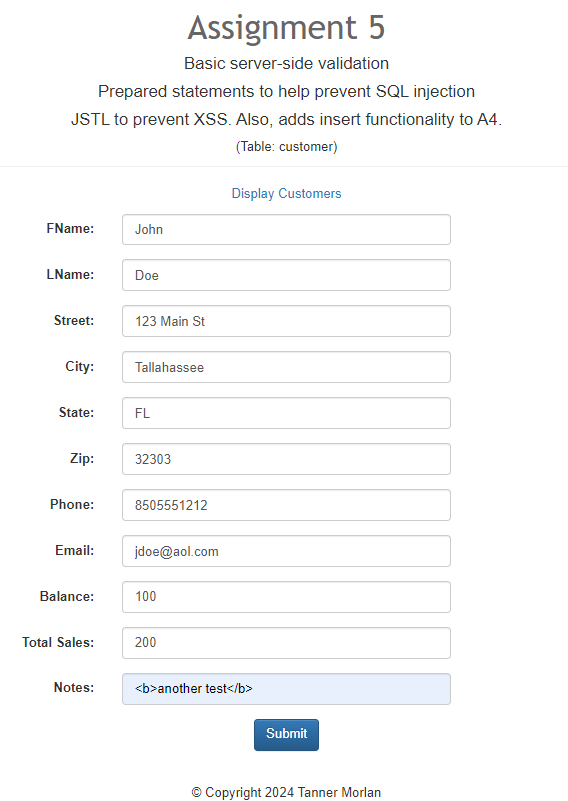
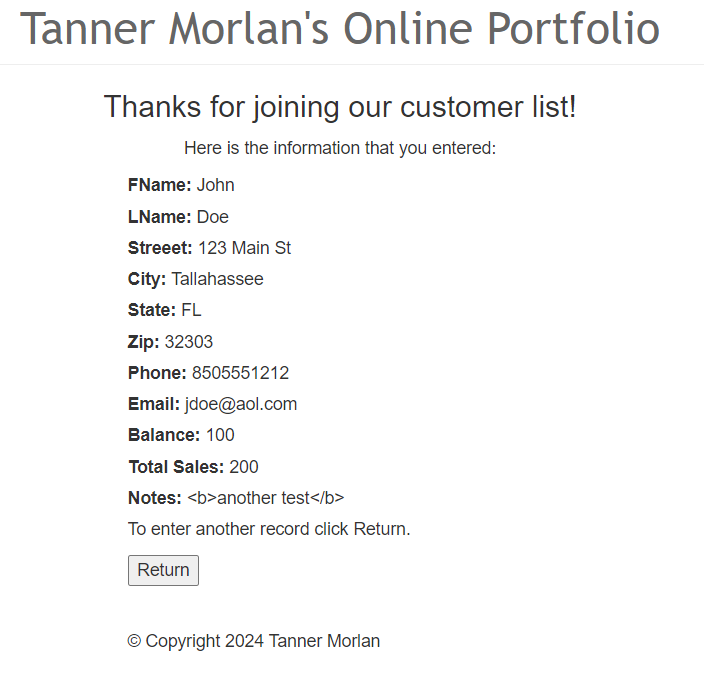
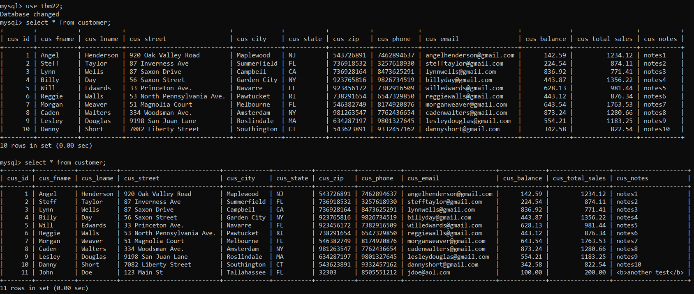
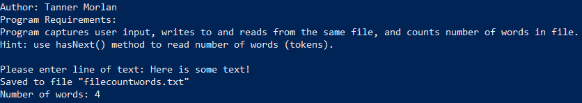
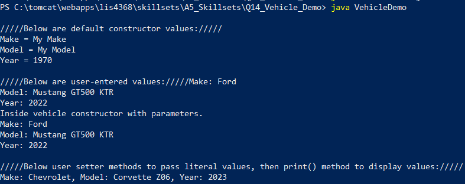
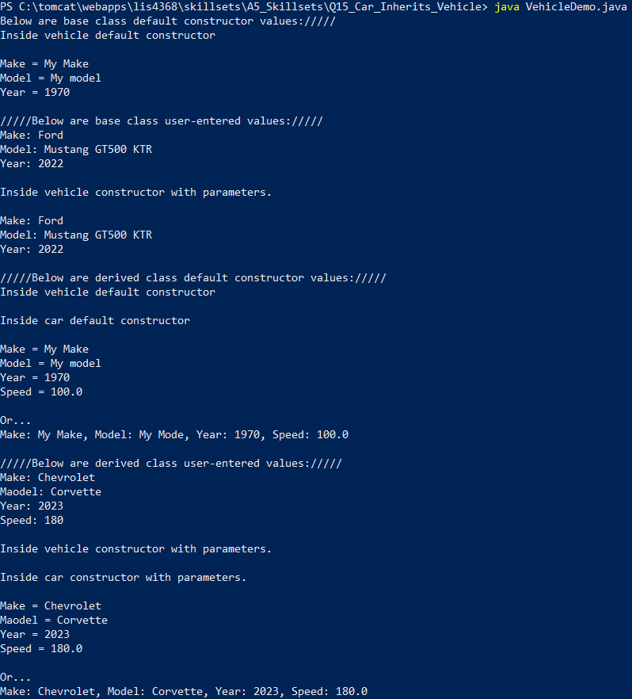

Delete this file and place *your* README.md file here.
> **NOTE:** This README.md file should be placed at the **root of each of your repos directories.**
>
>Also, this file **must** use Markdown syntax, and provide project documentation as per below--otherwise, points **will** be deducted.
>

# LIS 4368 - Advanced Web Applications

## Tanner Morlan

### Assignment 5 Requirements:

*Deliverables:*

1. Add "data" file to crud
1. Compile servlet files
1. Show Pre-filled form
1. Passed Validation
1. Show database before and after form submission
1. Complete Skillsets 13-15S

#### README.md file should include the following items:

* Screenshot of valid user form entry
* Screenshot of passed validation
* Screenshot of associated database entry
* Screenshots of skillsets

#### Assignment Screenshot and Links:
*Screenshot of Valid User Form Entry*:  

*Screenshot of Passed Validation*:  

#### Associated Database Entry

*Screenshot of Associated Database Entry*

#### Skillset Screenshots

*Screenshot of Skillset 13*

*Screenshot of Skillset 14*

*Screenshot of Skillset 15*

