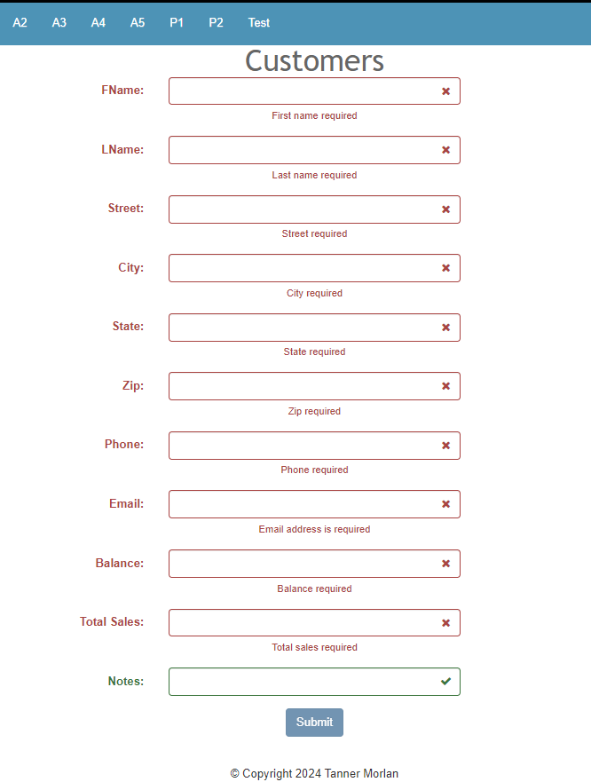
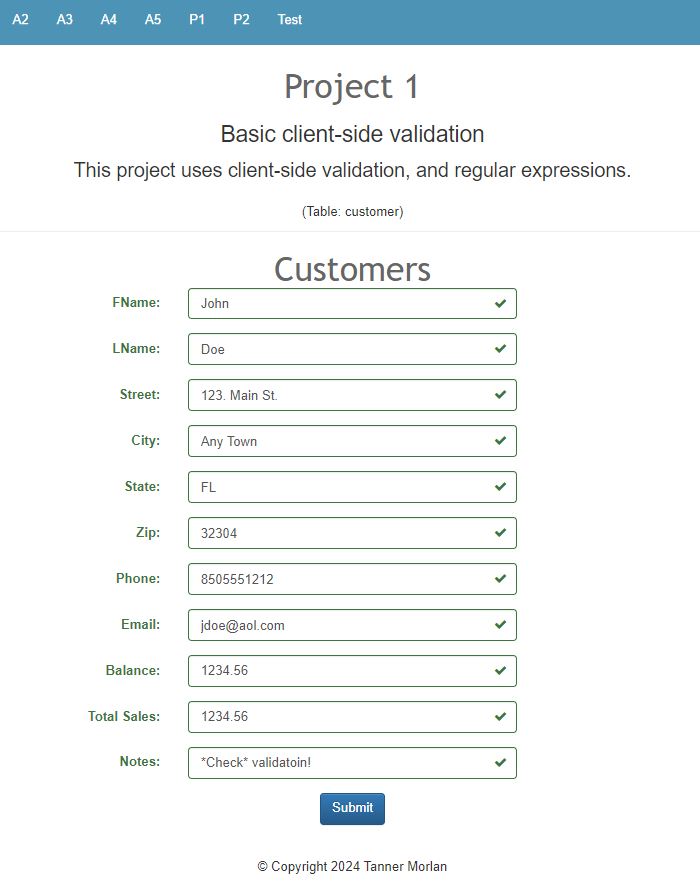
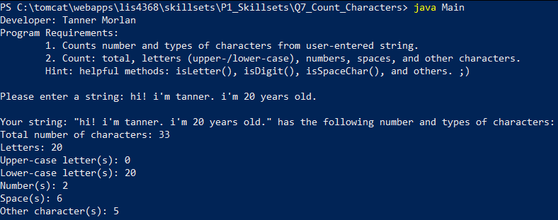
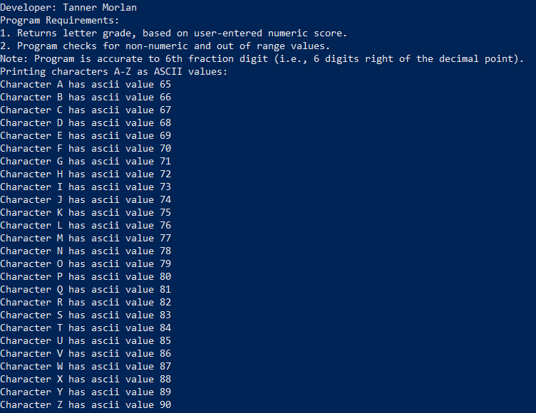
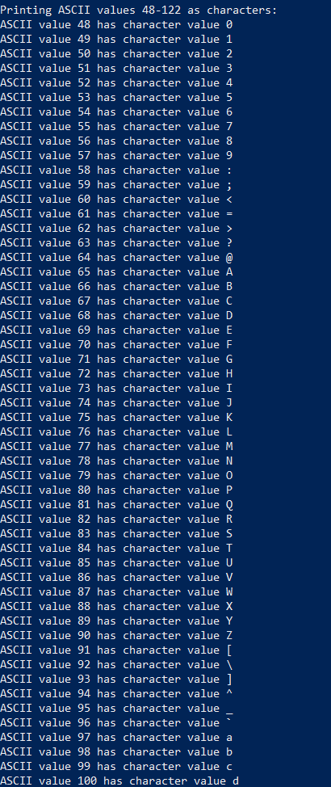
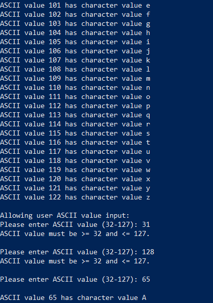
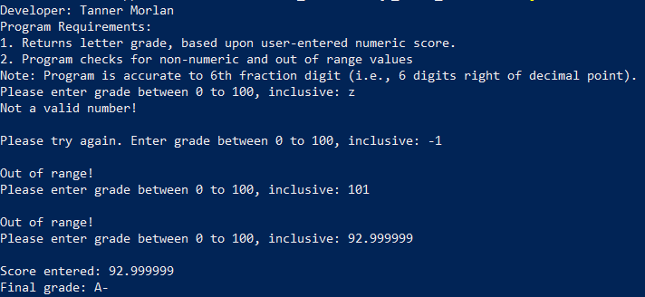

> **NOTE:** This README.md file should be placed at the **root of each of your repos directories.**
>
>Also, this file **must** use Markdown syntax, and provide project documentation as per below--otherwise, points **will** be deducted.
>

# LIS 4368 - Advanced Web Applications

## Tanner Morlan

### Project 1 Requirements:

*Deliverables:*

1. Use min/max jQuery validation
1. Use regexp to only allow appropriate characters for each control
1. Use HTML5 property to limit the number of characters for each control
1. Failed Validation
1. Passed validation

#### README.md file should include the following items:

* Screenshot of failed validation
* Screenshot of passed validation

#### Assignment Screenshot and Links:
*Screenshot of Failed Validation*:  

*Screenshot of Passed Validation*:  

#### Skillset Screenshots

*Screenshot of Skillset 7*

*Screenshot of Skillset 8*

  
  

*Screenshot of Skillset 9*

