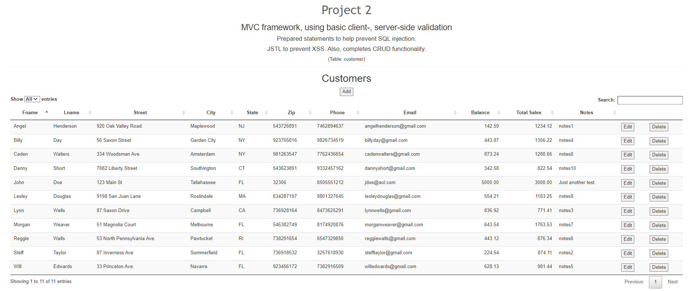
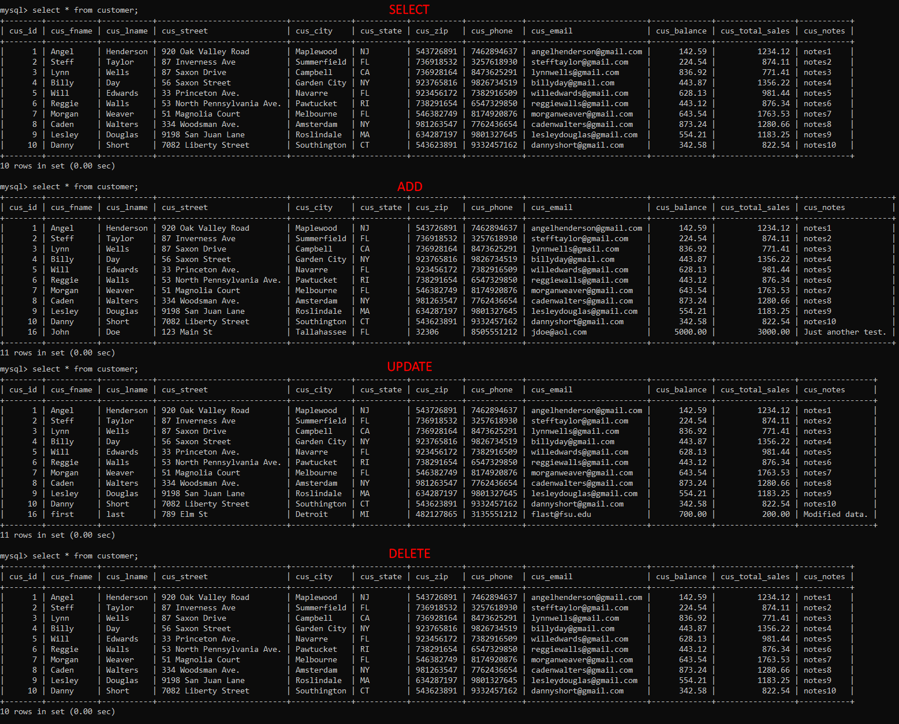

Delete this file and place *your* README.md file here.
> **NOTE:** This README.md file should be placed at the **root of each of your repos directories.**
>
>Also, this file **must** use Markdown syntax, and provide project documentation as per below--otherwise, points **will** be deducted.
>

# LIS 4368 - Advanced Web Applications

## Tanner Morlan

### Project 2 Requirements:

*Deliverables:*

1. Add create, read, update, and delete (CRUD) functionality
1. Compile servlet files
1. Show Pre-filled, valid user form entry
1. Show passed validation
1. Display data on website
1. Modify form to edit database
1. Display successfully modified data
1. Show warning for "delete" option
1. Show database with associated changes

#### README.md file should include the following items:

* Screenshot of valid user form entry
* Screenshot of passed validation
* Screenshot of display data
* Screenshot of modify form
* Screenshot of modified data
* Screenshot of delete warning
* Screenshot of associated database changes

#### Assignment Screenshots:
*Screenshot of Valid User Form Entry*:  

*Screenshot of Passed Validation*:  

*Screenshot of Display Data*:  

*Screenshot of Modify Form*:  

*Screenshot of Modified Data*:  

*Screenshot of Delete Warning*:  

*Screenshot of Associated Database Changes*:  
